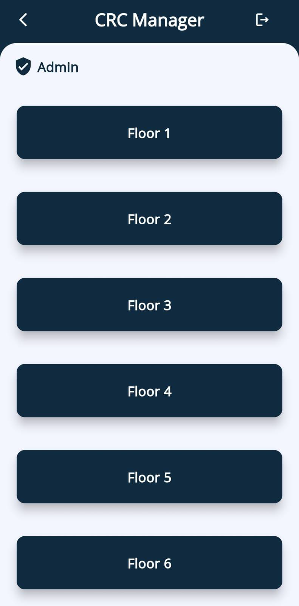

# 📚 Classroom Connect App

**A Classroom Booking & Key Handover Solution**

---

## 📌 Overview

In many institutes, booking a classroom for student or club activities required manual letters, approvals, and key handovers.  
**Classroom Connect** digitizes this process.

**Key Highlights:**
- Built with **Flutter** (Frontend)
- Backend using **Node.js**
- Database: **MongoDB**

---

## 🎯 Problem We Solved

Previously, students had to write letters to the **Classroom Complex Head** and get them signed to access rooms. Guards would then manually verify and hand over keys.  
There was no efficient way to track or verify bookings.

**Our Solution:**  
A secure, calendar-based booking app with **Admin** and **Guest** modes:
- Professors (Admins) book and manage classrooms.
- Students get OTPs for secure verification.
- Guards verify OTPs and handle key handover & return.

---

## 🔑 Features

✔️ **Role-Based Secure Login**  
✔️ **Floor & Classroom Selection**  
✔️ **Calendar-Based Booking Management**  
✔️ **OTP-Based Student Verification**  
✔️ **Key Return Confirmation & Tracking**

---

## 🖼️ App Screens

### 1️⃣ Choose User Mode

Users select **Admin** or **Guest (Guard)** on app launch.

---

### 2️⃣ Admin Login

Admins sign in with phone number & password.

---

### 3️⃣ Floor & Classroom Selection

Admin dashboard shows **6 floors**, and each floor has 4 classrooms to choose from.

---

### 4️⃣ Events Calendar

Admins view bookings, pick dates, add or delete events.

---

### 5️⃣ Create Event

Admin adds:
- Event name
- Date & time
- Student’s name & phone number  
OTP is generated & sent via local SMS.

---

### 📩 OTP Message Sent to Student

Once the event is created, the student receives an OTP on their phone.  
They use this OTP to verify with the guard.

---

### 6️⃣ OTP Verification (Guard)

Student provides OTP → Guard verifies → Keys are handed over.

---

### 7️⃣ Key Return Confirmation

Guard marks keys as returned → Classroom marked available.

---

## 👥 Team

| Name | Role |
|------|------------------------------|
| Hrushikesh Musaloj | Flutter Frontend Developer |
| Luv Neekhra | Flutter Frontend Developer |
| Shivam Raj | Node.js Backend Developer |
| Aritra Sarkar | Node.js Backend Developer |

---

## ⚙️ Tech Stack

- **Flutter** – Cross-platform mobile app
- **Node.js** – Backend server & API
- **MongoDB** – Database for bookings, users & OTPs
- **Local SMS** – OTP sent via Admin’s phone (no external SMS API)

---

## 🚀 How it Works

1️⃣ **Admin logs in → selects floor → books classroom → student receives OTP**  
2️⃣ **Student visits CRC → Guard verifies OTP → hands over keys**  
3️⃣ **Guard confirms keys returned → Room marked available again**

---

## 📎 License

© 2025 Web App & Game Development Club, VNIT.  
For internal use only.

---

## 🙌 Acknowledgements

Special thanks to our professors & CRC staff for their support & valuable feedback.
